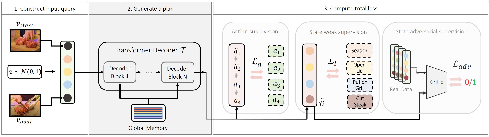

# P3IV: Probabilistic Procedure Planning from Instructional Videos with Weak Supervision

*[He Zhao](https://joehezhao.github.io/)*1,2, 
*[Isma Hadji](http://www.cse.yorku.ca/~hadjisma/)*1, 
*[Nikita Dvornik](https://thoth.inrialpes.fr/people/mdvornik/)*1,3, 
*[Konstantinos G. Derpanis](https://www.cs.ryerson.ca/kosta/)*1,2, 
*[Richard P. Wildes](http://www.cse.yorku.ca/~wildes/)*1,2, 
*[Allan D. Jepson](https://www.cs.toronto.edu/~jepson/)*1,

1Samsung AI Center (SAIC) - Toronto &nbsp;&nbsp;
2York University &nbsp;&nbsp;
3University of Toronto &nbsp;&nbsp;
* This research was conducted while He was an intern at SAIC-Toronto, funded by Samsung Research.

**Abstract**: In this paper, we study the problem of procedure planning in instructional videos. Here, an agent must produce a plausible sequence of actions that can transform the environment from a given start to a desired goal state. When learning procedure planning from instructional videos, most recent work leverages intermediate visual observations as supervision, which requires expensive annotation efforts to localize precisely all the instructional steps in training videos. In contrast, we remove the need for expensive temporal video annotations and propose a weakly supervised approach by learning from natural language instructions. Our model is based on a transformer equipped with a memory module, which maps the start and goal observations to a sequence of plausible actions. Furthermore, we augment our model with a probabilistic generative module to capture the uncertainty inherent to procedure planning, an aspect largely overlooked by previous work. We evaluate our model on three datasets and show our weakly-supervised approach outperforms previous fully supervised state-of-the-art models on multiple metrics.

## Model

  </img>

  </img>

