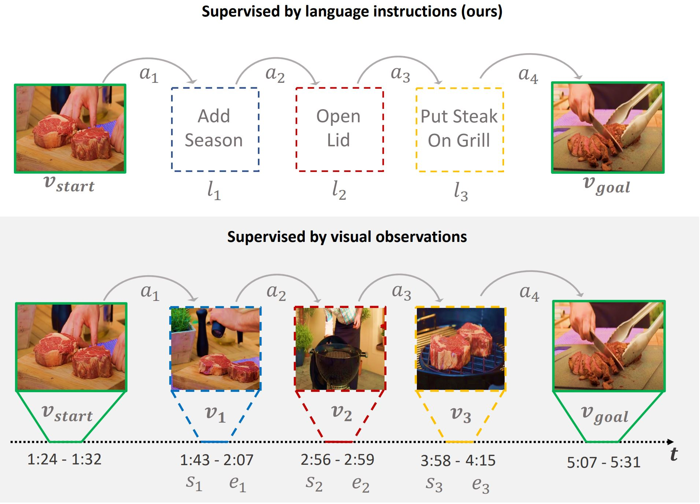

# P3IV: Probabilistic Procedure Planning from Instructional Videos with Weak Supervision

*[He Zhao](https://joehezhao.github.io/)*<sup>1</sup>, 
*[Isma Hadji](http://www.cse.yorku.ca/~hadjisma/)*<sup>2</sup>, 
*[Nikita Dvornik](https://thoth.inrialpes.fr/people/mdvornik/)*<sup>2,3</sup>, 
*[Konstantinos G. Derpanis](https://www.cs.ryerson.ca/kosta/)*<sup>1,2</sup>, 
*[Richard P. Wildes](http://www.cse.yorku.ca/~wildes/)*<sup>1,2</sup>, 
*[Allan D. Jepson](https://www.cs.toronto.edu/~jepson/)*<sup>2</sup>,

<sup>1</sup>York University &nbsp;&nbsp;
<sup>2</sup>Samsung AI Center (SAIC) - Toronto &nbsp;&nbsp;
<sup>3</sup>University of Toronto &nbsp;&nbsp;
* This research was conducted while He was an intern at SAIC-Toronto and is funded by Samsung Research.

**Abstract**: In this paper, we study the problem of procedure planning in instructional videos. Here, an agent must produce a plausible sequence of actions that can transform the environment from a given start to a desired goal state. When learning procedure planning from instructional videos, most recent work leverages intermediate visual observations as supervision, which requires expensive annotation efforts to localize precisely all the instructional steps in training videos. In contrast, we remove the need for expensive temporal video annotations and propose a weakly supervised approach by learning from natural language instructions. Our model is based on a transformer equipped with a memory module, which maps the start and goal observations to a sequence of plausible actions. Furthermore, we augment our model with a probabilistic generative module to capture the uncertainty inherent to procedure planning, an aspect largely overlooked by previous work. We evaluate our model on three datasets and show our weakly-supervised approach outperforms previous fully supervised state-of-the-art models on multiple metrics.

## Main Idea
<div align="center">
</img>
</div>

## Code
This repository contains PyTorch code for three datasets used in this paper: CrossTask [1], COIN [2] and NIV [3].

## CrossTask
(i) We provide two ways to step-up the dataset for CrossTask [1]. You can use pre-extracted features
```
cd datasets/CrossTask_assets
wget https://www.di.ens.fr/~dzhukov/crosstask/crosstask_release.zip
wget https://www.di.ens.fr/~dzhukov/crosstask/crosstask_features.zip
wget https://www.eecs.yorku.ca/~hezhao/crosstask_s3d.zip
unzip '*.zip'
```
or extract features from raw video using the following code
```
cd raw_data_process
python download_CrossTask_videos.py
python InstVids2TFRecord_CrossTask.py
bash lmdb_encode_CrossTask.sh 1 1
```
(ii) Train and Evaluation
Set the variable **train** (under **if \_\_name\_\_ == \_\_main\_\_**) to either True/False, to choose between train a network or evaluate a pre-trained model. By default, the code will load the used random datasplit (see datasplit.pth in ./checkpoints) as well as our pre-trained weights (included in ./checkpoints folder).
```
python CrossTask_main.py
```

## COIN
(i) Similarly, to use COIN dataset [2] on our approach, we provide pre-extracted features
```
cd datasets/CrossTask_assets
wget https://www.eecs.yorku.ca/~hezhao/coin_s3d.zip
unzip '*.zip'
```
or we support extracting features from raw video
```
cd raw_data_process
python download_COIN_videos.py
python InstVids2TFRecord_COIN.py
bash lmdb_encode_COIN.sh 1 1
```
(ii) The train/evaluation code for COIN is in the same design before.
```
python COIN_main.py
```

## NIV
(i) For the NIV dataset [3], either use pre-extracted features
```
cd datasets/NIV_assets
wget https://www.eecs.yorku.ca/~hezhao/niv_s3d.zip
unzip '*.zip'
```
or extract features from raw video by first
```
cd datasets/NIV_assets/videos
wget https://www.di.ens.fr/willow/research/instructionvideos/data_new.tar.gz
tar -xvzf data_new.tar.gz
find ./data_new -type f -name “*.mpg” | xargs -iF mv F .
```
and then jump to raw_data_process and process raw videos
```
cd raw_data_process
python InstVids2TFRecord_NIV.py
bash lmdb_encode_NIV.sh 1 1
```
(ii) The train/evaluation code for NIV is in the same design before.
```
python NIV_main.py
```

## Citation

If you find this code useful in your work then please cite

```bibtex
@inproceedings{he2022p3iv,
  title={P3IV: Probabilistic Procedure Planning from Instructional Videos with Weak Supervision},
  author={He, Zhao and Hadji, Isma and Nikita, Dvornik and Konstantinos, G., Derpanis and Richard, P., Wildes and Allan, D., Jepson},
  booktitle={Proceedings of the IEEE Conference on Computer Vision and Pattern Recognition},
  month = {June.},
  year={2022}
}
```

## References
[1] D. Zhukov et al. "Cross-task weakly supervised learning from instructional videos." CVPR'19.

[2] Y. Tang et al. "COIN: A large-scale dataset for comprehensive instructional video analysis." CVPR'19

[3] JB. Alayrac et al. "Unsupervised learning from narrated instruction videos." CVPR'16.
